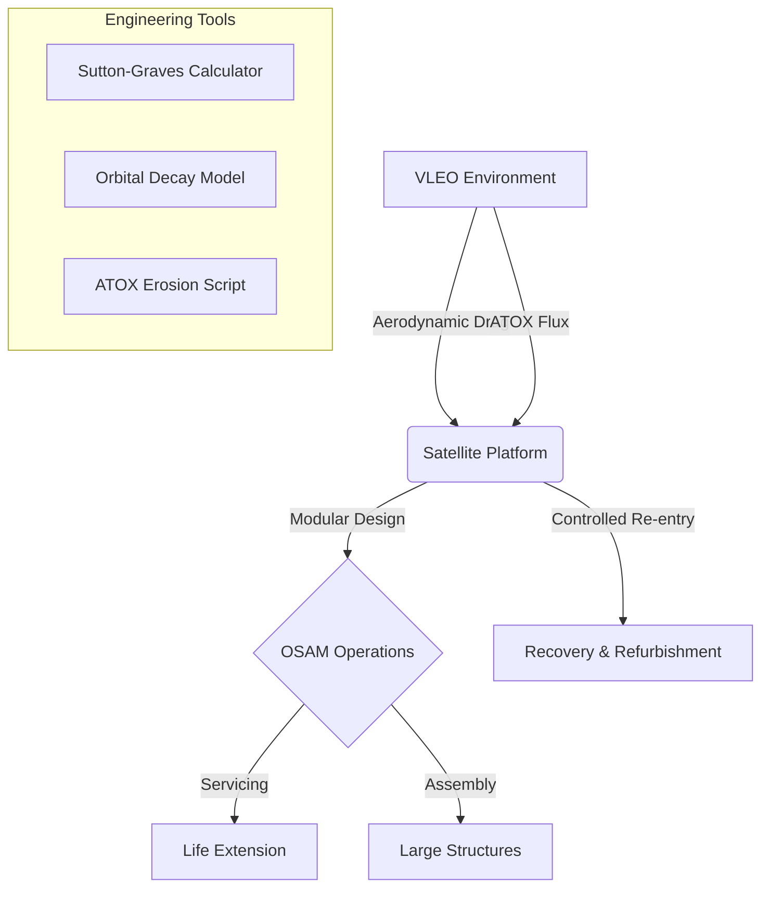

# 🛰️ Yeniden Kullanılabilir Uydu Teknolojileri ve Yörüngede Tamirat Mühendisliği

Bu portal; atmosferik uzay sınırı (**VLEO**), yeniden kullanılabilir uydu mimarileri ve yörüngede otonom servis, bakım ve tamirat (**OSAM**) teknolojilerini kapsayan, ileri düzey bir mühendislik müfredatı ve açık kaynaklı mühendislik araç setidir.

Havacılık, uzay, kontrol ve robotik mühendisliği disiplinlerinin kesişim noktasında yer alan yeni nesil uzay operasyonları için akademik ve pratik bir rehber sunmaktadır.

---

## 🎯 Stratejik Odak Alanları

Geleneksel uzay görevleri, uyduların ömrü bittiğinde sistemlerin uzay çöpüne dönüşmesi üzerine kuruludur. Bu proje; uzay sürdürülebilirliği için üç ana sütuna odaklanır:

1.  **VLEO (Very Low Earth Orbit):** 200-450 km arası irtifada aerodinamik etkiler ve Atomik Oksijen (ATOX) korozyonu altında operasyonel devamlılık.
2.  **Yeniden Kullanılabilirlik (Reusability):** Modüler bus mimarileri, Sutton-Graves tabanlı ısı akısı analizi ve kontrollü dikey iniş mekanizmaları.
3.  **OSAM (On-Orbit Servicing, Assembly, and Manufacturing):** Otonom yakınlaşma (RPO), hazırlıksız hedef yakalama (grappling) ve yörüngede yakıt ikmali.

---

## 🏗️ Teknik Mimari

---

## 📂 Depo Yapısı

| Klasör / Dosya | Açıklama |
| :--- | :--- |
| [**mufredat/**](./mufredat/) | Akademik ders içerikleri, haftalık planlar ve AKTS detayları. |
| [**scripts/**](./scripts/) | Yörünge mekaniği, Isıl Analiz (Sutton-Graves) ve ATOX araçları. |
| [**dashboard/**](./dashboard/) | [**Mission Control Dashboard**](./dashboard/index.html) - İnteraktif UI. |
| [**TERIMLER.md**](./TERIMLER.md) | Kapsamlı uzay ve havacılık teknik terimler sözlüğü. |
| [**Tasarım Rehberi**](./mufredat/ek/tasarim_rehberi.md) | Modüler uydu arayüzleri ve mühendislik standartları. |

---

## 🎓 Müfredat Özeti

### 🟦 1. Dönem: Sınır Fiziği ve Platform Mimarisi
*   **UYDU-101:** Karman Hattı fiziği, seyreltilmiş gaz aerodinamiği ve VLEO dinamiği.
*   **UYDU-102:** Plug-and-Play aviyonik, TPS (Thermal Protection Systems) seçimi ve dikey iniş.

### 🟩 2. Dönem: Otonom Uzay Robotiği ve Müdahale
*   **UYDU-201:** OSAM Teknikleri, RPO (Rendezvous) kinematiği ve hazırlıksız hedef yakalama.
*   **UYDU-202:** Capstone Projesi - Yörüngede modüler parça değişimi simülasyonu.

---

## 🛠️ Teknik Araçlar ve Simülasyon
*   **Sutton-Graves Analizi:** `scripts/reentry_thermal_analysis.py` ile durma noktası ısı akısı hesabı.
*   **VLEO Sürüklenme:** `scripts/vleo_drag_calculator.py` ile irtifa kaybı tahmini.
*   **ATOX Modelleme:** `scripts/atox_corrosion_model.py` ile malzeme aşınma analizi.

---

## 🚀 Başlangıç

Proje içeriklerini incelemek için [Müfredat Ana Sayfası](./mufredat/README.md) dosyasından başlayabilir veya [Mission Control Dashboard](./dashboard/index.html) üzerinden görsel bir tura çıkabilirsiniz.

---

## 📜 Lisans
Bu proje **MIT Lisansı** altında korunmaktadır. Detaylar için [LICENSE](./LICENSE) dosyasına bakınız.