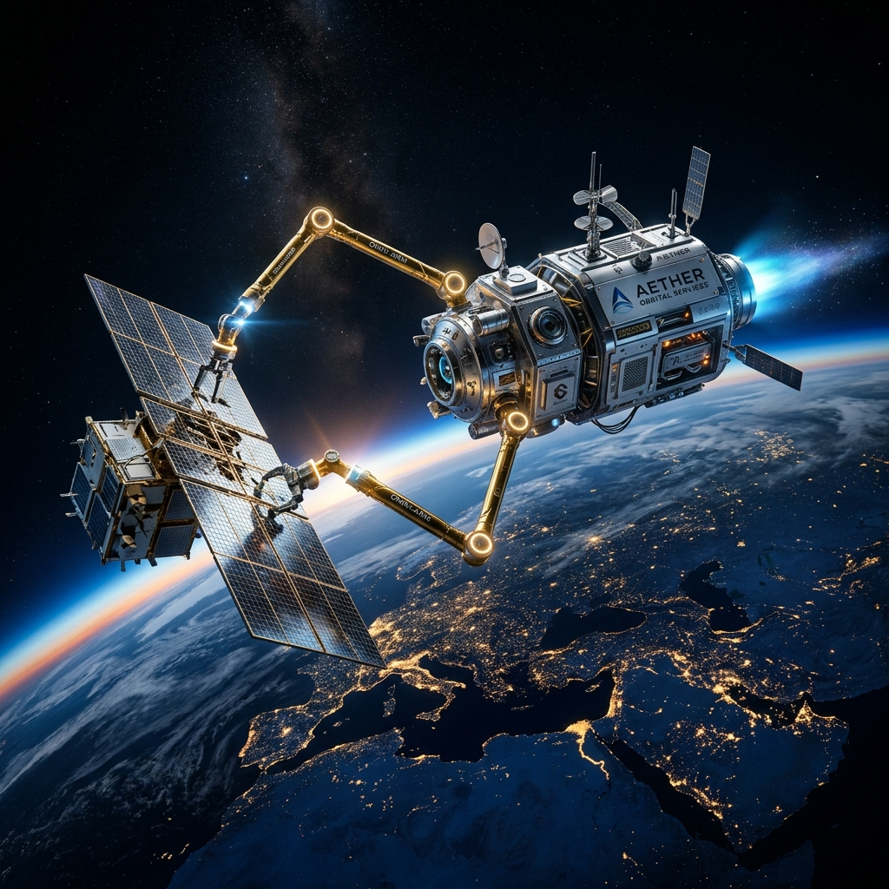
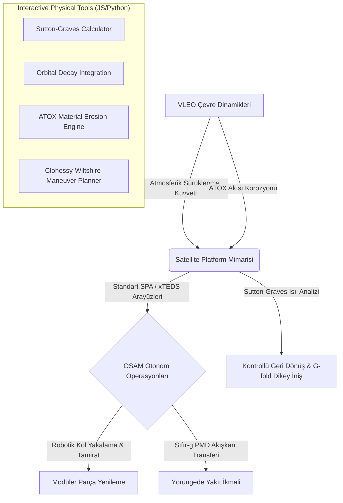

# 🛰️ Yeniden Kullanılabilir Uydu Teknolojileri ve Yörüngede Tamirat Mühendisliği

<p align="center">
  
</p>

[](https://opensource.org/licenses/MIT)
[](#)
[](#)
[](#)

Bu portal; atmosferik uzay sınırı (**VLEO**), yeniden kullanılabilir uydu platform mimarileri ve yörüngede otonom servis, bakım, yakıt ikmali ve robotik tamirat (**OSAM**) teknolojilerini kapsayan, ileri düzey bir mühendislik müfredatı ve gerçek zamanlı fizik motoru barındıran açık kaynaklı bir mühendislik araç setidir.

Havacılık, uzay, kontrol, mekanik ve robotik mühendisliği disiplinlerinin kesişim noktasında yer alan yeni nesil uzay operasyonları için kapsamlı bir akademik külliyat ve etkileşimli görsel simülasyon portalı sunmaktadır.

---

## 🎯 Stratejik Odak Alanları ve Temel Teoriler

Geleneksel uzay görevleri, uyduların ömrü bittiğinde sistemlerin uzay çöpüne dönüşmesi üzerine kuruludur. Bu proje, uzay sürdürülebilirliği ve ekonomisi için üç ana sütuna odaklanır:

### 1. VLEO (Very Low Earth Orbit) Operasyonları
$200 - 450 \text{ km}$ irtifa aralığı, seyreltilmiş gaz akışı (Rarefied Gas Dynamics) ve yüksek aşındırıcı **Atomik Oksijen (ATOX)** akısı altındadır. Portal kapsamında:
*   **Knudsen Sayısı ($Kn = \lambda / L$):** Akışın süreklilik rejiminden serbest moleküler akış rejimine geçiş sınırları.
*   **Seyreltilmiş Akış Sürüklenmesi:** Aynasal (specular) ve dağınık (diffuse) yansımalara dayalı Maxwell momentum uyum katsayıları çerçevesinde Schaaf-Chambre aerodinamik modelleri.
*   **RAM-EP (Atmosferik Elektrikli İtki):** Sonsuz yörünge ömrü için seyrek havayı toplayarak xenon yerine azot/oksijen iyonize eden motor fiziği.

### 2. Platform Yeniden Kullanılabilirliği ve Geri Dönüş
Uzay araçlarının yörüngede kalması yerine dünyaya dikey dikey iniş yapabilmesi veya modüler yapıda olması:
*   **Sutton-Graves Isı Akısı Modellemesi ($q_s = k \sqrt{\rho / R_n} V^3$):** Hipersonik atmosfere geri dönüş (re-entry) sırasında durma noktasında (stagnation point) oluşan konvektif ısı akısı analizi.
*   **G-fold Konveks Optimizasyon Algoritması:** TVC (Thrust Vector Control - İtki Yönlendirme) gimbal kısıtları altında yakıt-optimal dikey iniş kontrolcü tasarımı.
*   **SPA/xTEDS Standartları:** Yeni aviyonik modüllerinin ana bilgisayar tarafından otomatik tanınmasını sağlayan veri ve veri yolu mimarisi.

### 3. OSAM (On-Orbit Servicing, Assembly, and Manufacturing)
Uyduların ömrünü yörüngede uzatan otonom operasyonlar:
*   **Clohessy-Wiltshire (Hill) Bağıntılı Hareket Denklemleri:** Dairesel yörüngedeki hedefe yaklaşan servis aracının 3D bağıntılı konum matris çözümleri.
*   **Serbest-Yüzen (Free-floating) Uzay Manipülatör Kinematiği:** Açısal momentumun korunumu nedeniyle tabanı serbest hareket eden kolların Etkin Jacobian ($J^*$) denklemleri.
*   **PMD (Propellant Management Devices):** Sıfır yerçekiminde kılcallık (Young-Laplace) etkisinden yararlanarak yakıt portuna sıvı yönlendiren tank içi yapılar.

---

## 🏗️ Teknik Mimari ve Blok Diyagramı



---

## 📂 Depo Yapısı ve Clickable Dosya Haritası

| Klasör / Dosya | Açıklama |
| :--- | :--- |
| 📚 [**mufredat/**](./mufredat/README.md) | Akademik ders yapısı, AKTS kredileri ve öğrenim çıktıları özeti. |
| 📘 [**donem-1/UYDU-101**](./mufredat/donem-1/01_atmosferik_sinir_vleo.md) | VLEO dinamiği, Knudsen rejimleri, ATOX korozyonu ve RAM-EP teorisi. |
| 📙 [**donem-1/UYDU-102**](./mufredat/donem-1/02_platform_mimarisi.md) | Modüler bus tasarımı, xTEDS XML, Sutton-Graves katsayıları ve G-fold optimizasyonu. |
| 📗 [**donem-2/UYDU-201**](./mufredat/donem-2/03_yorungede_servis.md) | CW relatif hareket çözümleri, EKF/UKF 6-DOF tahmini, uzay robotiği ve PMD. |
| 📕 [**donem-2/UYDU-202**](./mufredat/donem-2/04_bitirme_projesi.md) | Capstone (Bitirme Projesi) entegre görevi, sınır şartları ve rubrik detayları. |
| 📐 [**ek/tasarim_rehberi.md**](./mufredat/ek/tasarim_rehberi.md) | Modüler mekanik raylar, pogo-pin arayüzleri ve acil durum bırakma (DR) kuralları. |
| ♻️ [**ek/surdurulebilirlik_ve_cop.md**](./mufredat/ek/surdurulebilirlik_ve_cop.md) | Kessler olasılık modelleri, FCC 5-yıl kuralı ve EDT elektromanyetik Lorentz frenlemesi. |
| 📂 [**ek/vaka_analizleri.md**](./mufredat/ek/vaka_analizleri.md) | MEV-1/2 kenetlenme sonde analizleri, ESA ClearSpace-1 ve NASA OSAM-1 RRT post-mortem incelemesi. |
| 📝 [**quiz/oz_degerlendirme.md**](./mufredat/quiz/oz_degerlendirme.md) | Matematiksel ve sayısal problemler içeren öz-değerlendirme sınav setleri. |
| 💻 [**dashboard/**](./dashboard/index.html) | **Mission Control Dashboard** - JS tabanlı interaktif fizik motoru ve simülatör. |
| 🛠️ [**scripts/**](./scripts/) | Yörünge bozunumu, ısıl kalkan ve ATOX korozyon hesabı yapan Python araçları. |
| 📖 [**TERIMLER.md**](./TERIMLER.md) | Kapsamlı uzay, aerodinamik ve robotik teknik terimler sözlüğü. |

---

## 💻 Mission Control İnteraktif Fizik Simülatörü

[**`dashboard/index.html`**](./dashboard/index.html) adresinde yer alan görsel kontrol paneli, tamamen bağımsız bir tarayıcı tabanlı fizik simülatörüdür. 

### ⚙️ Çalışma Prensibi ve Özellikler:
*   **İnteraktif Sürgüler (Sliders):** Kullanıcılar; yörünge irtifasını ($150 - 500 \text{ km}$), uydu kütlesini, kesit sürüklenme alanını, burun yarıçapını, maruz kalma süresini ve yüzey malzemesini anlık olarak değiştirebilir.
*   **Gerçek Zamanlı Fizik Çözücü (JS Engine):**
    *   **Atmosferik Yoğunluk:** $\rho = \rho_0 e^{-(h-200)/45} \text{ kg/m}^3$ üstel modeli çözülür.
    *   **Yörünge Hızı:** Lokal dairesel hız $V = \sqrt{GM/r}$ hesaplanır.
    *   **Günlük İrtifa Kaybı & Yörünge Ömrü:** $dh/dt$ bozunma diferansiyel oranına göre uydunun LEO sınırına ($150\text{ km}$) kaç günde düşeceği entegre edilir.
    *   **Termal Isı Akısı:** Sutton-Graves denklemine göre stagnation ısı akısı hesaplanır ve otomatik TPS kalkan kalınlık/malzeme sınıfı (FRSI, HRSI karoları, RCC, PICA-X) önerilir.
    *   **ATOX Erozyonu:** Seçilen malzemenin ($Kapton, Teflon, Gümüş, Karbon, SiO_2$) aşınma reaktivitesine ($E_y$) göre mikrometrik aşınma derinliği (mm) ve kütle kaybı (g) hesaplanır.
*   **Dinamik Görsel Arayüz:** Dünya etrafındaki uydu yörüngesi görsel olarak seçilen yüksekliğe göre dairesel çapını genişletir/daraltır; uydu hızı çizgisel hıza bağlı olarak fiziksel doğrulukla değişir. 200 km altına inildiğinde acil tehlike uyarısı (alarm banner) tetiklenir.

---

## 🛠️ Python Analiz Araçları ve Simülasyonlar

Python betikleri (`scripts/` dizininde) yörünge mekaniği, malzeme erozyonu ve yakıt analizleri için konsol tabanlı doğrulamalar sunar:

1.  **VLEO Sürüklenme:** `scripts/vleo_drag_calculator.py` ile irtifaya bağlı sürüklenme kuvveti ($F_d$) ve yörünge bozunumu.
2.  **Sutton-Graves:** `scripts/reentry_thermal_analysis.py` ile durma noktası convective ısı akısı hesabı ve TPS malzeme seçimi.
3.  **ATOX Modelleme:** `scripts/atox_corrosion_model.py` ile 1 yıllık birikimli ATOX akısı altında malzeme kütle kaybı.
4.  **Yakıt Bütçesi:** `scripts/fuel_budget_calculator.py` ile Hohmann transferi, ACS ve de-orbit manevralarının Tsiolkovsky roket denklemiyle delta-V/propellant hesabı.
5.  **Birleşik Arayüz:** `scripts/mission_control_cli.py` ile tüm bu araçlara konsol üzerinden etkileşimli erişim sağlayan CLI.

### Çalıştırma:
```powershell
# Gerekli bağımlılıklar standart python kütüphaneleridir (math, os, sys)
# Mission Control terminal arayüzünü çalıştırmak için:
python scripts/mission_control_cli.py
```

---

## 🎓 Akademik Müfredat Kredileri ve AKTS Dağılımı

Eğitim müfredatı, Avrupa Yükseköğretim Alanı standartlarına (Bologna Süreci) uygun şekilde **30 AKTS** toplam yükle tasarlanmıştır:

*   **UYDU-101 (Atmosferik Uzay Sınırı ve VLEO Dinamiği):** 7.5 AKTS | Güz Dönemi
*   **UYDU-102 (Yeniden Kullanılabilir Uydu Platform Tasarımı):** 7.5 AKTS | Güz Dönemi
*   **UYDU-201 (Yörüngede Servis, Bakım ve Tamirat - OSAM):** 7.5 AKTS | Bahar Dönemi
*   **UYDU-202 (Bitirme Projesi - Capstone Görevi):** 7.5 AKTS | Bahar Dönemi

---

## 📖 Atıfta Bulunulan Mühendislik Standartları ve Kılavuzlar

Portal kapsamında sunulan teorik altyapılar ve mühendislik gereksinimleri şu uluslararası belgelere dayanmaktadır:
1.  **NASA Systems Engineering Handbook (NASA/SP-2020-5002):** Sistem mühendisliği süreçleri ve SDR/PDR/CDR kilometre taşları.
2.  **AIAA S-111A:** Space Plug-and-Play Architecture (SPA) veri ve elektriksel arayüz serisi.
3.  **ISO 24330:2022:** *Space systems — Rendezvous and Proximity Operations (RPO) and On-Orbit Servicing (OOS) Requirements*.
4.  **ECSS Standards (European Cooperation for Space Standardization):** Uzay projeleri kalite, aviyonik ve mekanik arayüz yönetmelikleri.

---

## 📜 Lisans

Bu proje **MIT Lisansı** altında korunmaktadır. Ticari ve akademik amaçlarla serbestçe kullanılabilir, değiştirilebilir ve dağıtılabilir. Detaylar için [LICENSE](./LICENSE) dosyasına bakınız.